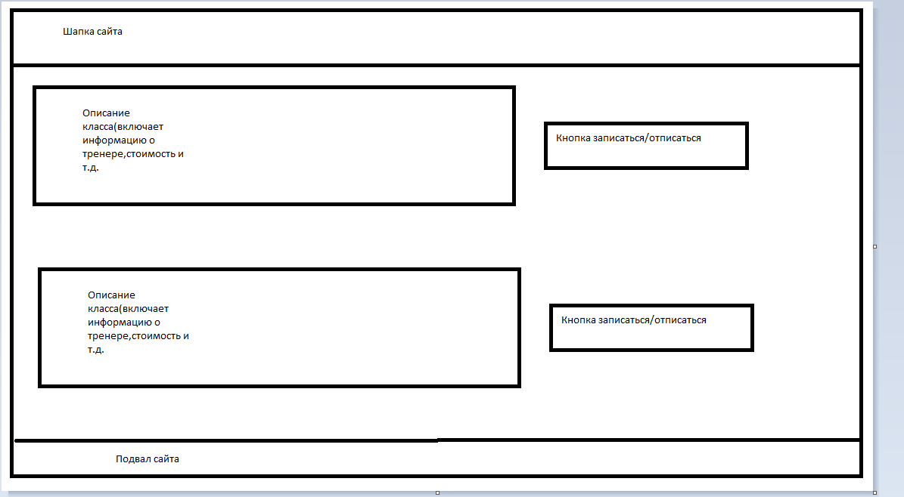
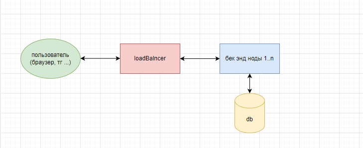

# kotlin-marketplace-yoga

### Название проекта:

    Йога-это просто(но это не точно)

### Краткое описание:

    Приложение для администрирования школы йоги, позволяет организовать работу классов по йоге(составление расписания 
    тренировок,запись и отмена записи на тренировку,уведомление о сегодняшнем занятии)

### Целевая аудитория:

    1. Пол - 90% женский,10-мужской
    2. Возраст - 27-42
    3. Места пребывания - локально, по месту расположения школы
    4. Проф. опыт - любой, в основном оффисные работники
    5. Доход - выше среднего ( от 40к в месяц)
    6. Увлечения - саморазвитие, здоровый образ жизни

### Описание MVP:

    1. Просмотр доступных классов(пользователь, тренер, администратор)
    2. Возможность записаться на занятие(пользователь)
    3. Возможность отписаться с занятия(пользователь)
    4. Возможность изменить время занятия(администратор)
    5. Возможность сменить тренера на занятии(администратор)
    6. Напоминание о предстоящем занятии(пользователь, тренер) 

### Эскиз фронтенд-представления

### Основные сущности

    1. User(id,1st name, 2nd name, surname, full name, email, phone, role)
    2. Class(id, officeAddress, trainer, students, time)
    3. Office(id, address)

### Архитектурное видение приложения:

    